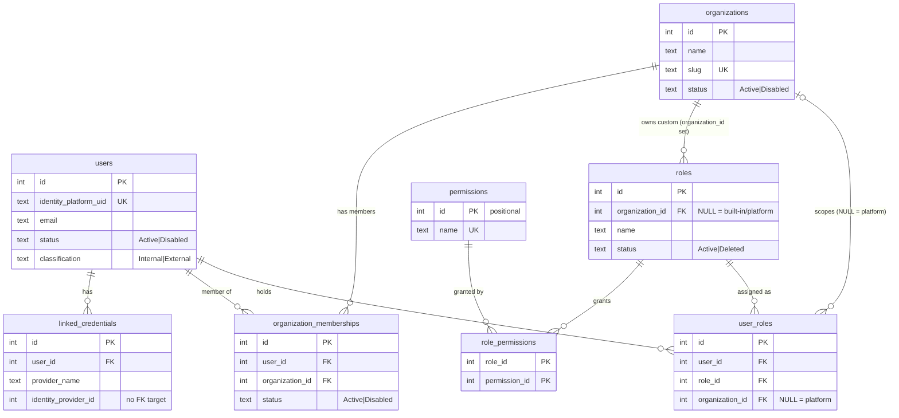
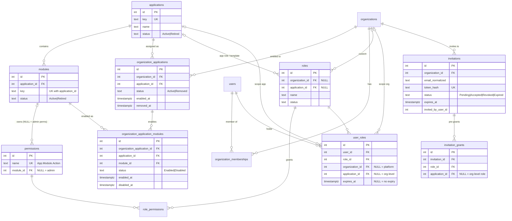

# Organization → Application → Module access model

How far the Identity backend is from the target model, and the smallest design
that gets there.

- **Investigation:** 2026-10-05, read-only; no source, migration or database changes.
- **Schema source:** the EF Core model snapshot `IdentityDbContextModelSnapshot.cs`, which matches the migrations through `20261005044925_AddOrganizationUpdatePermission`. The live database wasn't queried.
- **Paths:** relative to `backend/` unless noted.

## 1. Summary

The current system implements **two** scopes: platform and organization. It has
no notion of an application or a module anywhere: no tables, no permission
dimension, no route context, nothing in `/me`.

The foundations the target model needs are solid and reusable:
- deny-by-default
- permission-only checks
- the escalation guard
- last-admin protection
- one transaction plus audit per write
- the membership guard
- the cross-tenant test sweep

The design below adds a third scope, **(organization, application)**. It uses
two catalog tables, two entitlement tables and two nullable columns. It is
additive and needs no backfill.

**The five most important findings:**

1. **No application or module concept exists.** There are no catalog tables and no org→app link. `PermissionScope(UserId, OrganizationId?)` can't carry an application, and no request carries application context. Every target capability below the organization level is **Missing**.
2. **Existing permissions are not module-owned.** `Invoice.*` and `Report.*` are generic catalog entries with no module. They have to be re-homed to a module or retired before module enforcement means anything.
3. **Internal vs external is decided once and never re-checked.** `users.classification` is set from the token's `hd` claim at first provisioning only (`ProvisionCurrentUserHandler`). A user classified Internal who later signs in through a linked email/password provider keeps Internal. **MFA and `email_verified` are not checked anywhere.**
4. **A deactivated organization is not blocked.** `OrganizationMembershipGuardMiddleware` checks membership status only, not `organizations.status`, so "deactivate an org" doesn't block access today.
5. **No invitation or pre-grant mechanism exists.** `PendingRoleGrant` and `UserProvisioningState` exist in neither repo, and org admins can only add members by user id. Invitations by email have to be designed fresh (section 8.7).

## Decisions (2026-10-05)

Answers to section 15. They are binding for implementation, and the sections below have been updated to match.

| # | Question | Decision | Effect on the design |
| --- | --- | --- | --- |
| 1 | Permission naming | **One global name per permission:** `{App}.{Module}.{Action}`, e.g. `PriceOptimizer.Invoices.Read` | `permissions.name` stays globally unique (5.2) |
| 2 | Catalog source of truth | **In code, seeded by migrations** | Applications, modules and permissions are static classes appended to the catalog. Admin endpoints change display and status only (5.2, 10) |
| 3 | Who grants application access | **Only application admins (in that org and app) or platform admins.** Org admins can't grant app roles | No escalation-guard exception. Org admins manage membership and org-level roles only (7) |
| 4a | External customer admins | **Allowed:** an external user may be their org's OrganizationAdministrator or an application admin | The "no admin roles for external users" rule applies to **platform** roles only (8.1) |
| 4b | MFA | **Not enforced now.** MFA is not yet on in the GCIP project | No MFA gate in v1. The design keeps a slot for it (8.1) |
| 5 | App removal | **Delete all its grants** | Hard-revoke cascade, each audited (8) |
| 6 | Module enablement | **Platform admins only** (modules are licensed) | `Module.Manage` @ platform; routes under `/api/admin/…` (7, 10) |
| 7 | Generic `Invoice.*` / `Report.*`, first apps | **Blank slate:** no applications or modules seeded; the generic permissions are retired | Retire = stop granting them (remove from OrganizationAdministrator). The catalog rows stay, because ids are positional (12) |
| 8 | Custom claims | **Database is the only source;** no claims | No Firebase Admin SDK (8.1) |
| 9 | v1 scope | **Grant expiry now;** seat limits and bulk operations later | `user_roles.expires_at` in v1 (5.4, 8.3) |
| 10 | Application-admin tier | **Yes, in v1** | Template "{App} Administrator" with `Application.ManageAccess` @ (O, A); last-app-admin protection (7, 8) |
| 11 | Creating organizations | **Platform-admin only** | `POST /api/organizations` (self-service) is replaced by `POST /api/admin/organizations`, which names the first admin (an existing user or an invitation). Breaking for the frontend (10, 14) |
| 12 | Platform access and sign-in method (follow-up, 2026-10-05) | **Platform access requires a Google Workspace sign-in on every request** | Platform-scoped permissions resolve only when the token's `hd` is on `INTERNAL_HD_ALLOWLIST`; 403 `workspace_sign_in_required` otherwise (8.1) |

## 2. Current schema (ERD)

### 2.1 Tables

All tables are in the `identity` schema except `audit.audit_logs`. Every FK is `ON DELETE RESTRICT`.

| Table | Columns | Keys and indexes | Notes |
| --- | --- | --- | --- |
| `users` | id, identity_platform_uid, email, status, classification, created_at, updated_at | PK id; **UQ** `ux_users_identity_platform_uid`; IX status, classification | CHECK status ∈ (Active, Disabled); CHECK classification ∈ (External, Internal) |
| `linked_credentials` | id, user_id, provider_name, identity_provider_id, status, created_at, updated_at | PK id; **UQ** (user_id, provider_name); IX identity_provider_id, status | FK user_id → users. `identity_provider_id` has **no backing table** (an enterprise-SSO remnant). CHECK status ∈ (Active, Orphaned) |
| `organizations` | id, name, slug, status, created_at, updated_at | PK id; **UQ** `ux_organizations_slug`; IX status | CHECK status ∈ (Active, Disabled) |
| `organization_memberships` | id, user_id, organization_id, status, created_at, updated_at | PK id; **UQ** (user_id, organization_id); IX organization_id, status | FKs to users, organizations. CHECK status ∈ (Active, Disabled) |
| `roles` | id, organization_id NULL, name, description, status, created_at, updated_at | PK id; **UQ** (organization_id, name); **UQ** name WHERE organization_id IS NULL; IX organization_id | FK organization_id → organizations. CHECK status ∈ (Active, Deleted). Built-ins: OrganizationAdministrator (id 1), PlatformAdministrator |
| `permissions` | id, name, created_at, updated_at | PK id; **UQ** name | 18 rows. Ids are positional in `Permissions.All`, seeded with `HasData` |
| `role_permissions` | role_id, permission_id | **PK** (role_id, permission_id); IX permission_id | FKs to roles, permissions |
| `user_roles` | id, user_id, role_id, organization_id NULL, created_at, updated_at | PK id; **UQ** (user_id, role_id, organization_id); **UQ** (user_id, role_id) WHERE organization_id IS NULL; IX user_id, role_id, organization_id | FKs to users, roles, organizations. NULL organization means platform scope |
| `audit.audit_logs` | id, event_type, user_id, organization_id, actor_type, service_principal_id, metadata (jsonb), event_time, exported | PK id; IX event_time, event_type, organization_id, service_principal_id, user_id | Owned by `AuditDbContext`, with no FKs (ids by value) |
| `quickbase.query_caches` | (QuickbaseEngine) | n/a | Not part of identity |

### 2.2 Current ERD



### 2.3 Direct answers

| Question | Answer |
| --- | --- |
| Application entity? | **No.** |
| Module entity? | **No.** |
| Organization-to-application link? | **No.** |
| Per-org module enablement? | **No.** |
| Where do roles and permissions attach? | **Platform** (`user_roles.organization_id IS NULL`) or **organization** (`organization_id` set). Nothing finer. Roles themselves are platform-defined built-ins (`roles.organization_id NULL`) or org custom roles. |
| How does `PermissionScope` work? | `readonly record struct PermissionScope(int UserId, int? OrganizationId)` (`Application/Abstractions/IPermissionCache.cs`). `AuthorizationQueries.GetPermissionNamesAsync` selects the user's active roles **exactly** in that scope (`organization_id = X`, or `IS NULL`) and unions their permission names. It **can't** carry an application or module; adding one is a struct field plus a query change. |
| Internal vs external? | `users.classification`, set **once** at first provisioning. It is `Internal` when the token's `hd` claim is in `INTERNAL_HD_ALLOWLIST` (`ProvisionCurrentUserHandler`, `InternalHdAllowlistOptions`), otherwise `External`. It is never re-evaluated. `firebase.sign_in_provider` is stored on link only and is "never part of a security decision" (`IReauthTokenValidator`). There are no custom claims. |
| Can a user belong to more than one org? | **Yes.** Memberships are unique per (user, org), and roles are per org. |
| Leftover RBAC tables? | None in wrigley-web. `Admin` / `InvoiceAdmin` / `InvoiceUser` and the `perm:{key}` policies live in the separate **liverpool** repo. `PendingRoleGrant` and `UserProvisioningState` exist in **neither** repo. The only remnants are `linked_credentials.identity_provider_id` (no target table) and the generic `Invoice.*` / `Report.*` permissions (catalog ids 10–16). |

## 3. Current API and authorization flow

### 3.1 Endpoints

The full matrix, with deny tests, is in `../ADMIN-API-STATUS.md` ("Endpoint authorization matrix"). Summary:

| Route | Verb | Authorization | Handler |
| --- | --- | --- | --- |
| `/api/users/me` | GET | authenticated | `GetCurrentUserHandler` |
| `/api/users/me/linked-providers/link` | POST | authenticated + matching re-auth token | `LinkProviderHandler` |
| `/api/users` | GET | `User.Read` @ platform | `UserReadService.ListAsync` |
| `/api/users/{id}` | GET | `User.Read` @ platform | `UserReadService.GetAsync` |
| `/api/users/{id}/disable` | POST | `User.Update` @ platform | `UserStatusService` |
| `/api/users/{id}/enable` | POST | `User.Update` @ platform | `UserStatusService` |
| `/api/users/{id}/roles` | POST | `Role.Assign` in org (service), or `Admin.Access` + `Role.Assign` @ platform | `UserRoleAssignmentService.AssignAsync` |
| `/api/users/{id}/roles/{roleId}` | DELETE | same as above | `UserRoleAssignmentService.RevokeAsync` |
| `/api/organizations` | POST, GET | authenticated (create; list mine) | `CreateOrganizationHandler`, `ListMyOrganizationsHandler` |
| `/api/organizations/{organizationId}` | GET, PUT | guard + `User.Read` / `Organization.Update` | `OrganizationReadService`, `OrganizationAdminService` |
| `/api/organizations/{organizationId}/members` | GET | guard + `User.Read` | `OrganizationReadService` |
| `/api/organizations/{organizationId}/members/{userId}` | POST, DELETE | guard + `User.Update` | `OrganizationAdminService` |
| `/api/organizations/{organizationId}/roles[/{id}[/permissions]]` | GET | guard + `Role.Read` | `RoleReadService` |
| `/api/roles` | POST | `Role.Create` in body org (service) | `RoleService` |
| `/api/roles/{id}` | PUT, DELETE | `Role.Update` / `Role.Delete` in role's org (service) | `RoleService` |
| `/api/roles/{id}/permissions[/{name}]` | POST, DELETE | `Role.Update` in role's org (service) | `RoleService` |
| `/api/permissions` | GET | authenticated | `ListPermissionsHandler` |

**No endpoint touches applications or modules.**

### 3.2 How a permission is resolved today

1. **JWT bearer:** the GCIP ID token is validated (RS256, issuer and audience equal the project, lifetime ≤ 1 h).
2. **`DisabledUserGateMiddleware`:** a disabled `users.status` gets 403 `user_disabled`. It reads the database on every request.
3. **`OrganizationMembershipGuardMiddleware`:** runs only if the route has a value named exactly `organizationId`. It requires an active `organization_memberships` row, otherwise 403 `no_active_membership`. It does **not** check `organizations.status`.
4. **`[RequirePermission(name, PlatformScope)]`** → `PermissionAuthorizationHandler`. The organization comes from the route `{organizationId}`, or is null for platform scope.
5. **`PermissionResolver.HasPermissionAsync(uid, orgId, name)`** → `PermissionScope(userId, orgId)` → `IPermissionCache` (a pass-through today) → `AuthorizationQueries.GetPermissionNamesAsync`.

**How would the resolver know the application?** It can't. No route segment, header, claim or `PermissionScope` field carries one, and `user_roles` has no column for it. Section 9 makes it a route segment.

### 3.3 Is `/me` enough for gating apps and modules?

**No.** `GET /api/users/me` returns `roles` (roleId, name, organizationId) and
`permissions` grouped per scope (platform or each org with an active
membership), from `PermissionResolver.GetEffectiveAccessAsync`. That's enough
to gate organization and platform admin UI, but it has no applications,
modules, or app-level grants. Section 10 extends it to orgs → apps → modules →
permissions.

## 4. Gap analysis

| Capability | Status | Evidence |
| --- | --- | --- |
| **Entities** | | |
| Organization | **Exists** | `organizations`, `Organization.cs` |
| Application (catalog) | **Missing** | no table or entity |
| Module (catalog) | **Missing** | no table or entity |
| Module-owned permissions | **Missing** | `permissions` has no `module_id`; `Invoice.*` / `Report.*` are generic |
| Invitations / pre-grants | **Missing** | no table in either repo |
| **Relationships** | | |
| User ↔ organization (many-to-many) | **Exists** | `organization_memberships` |
| Organization ↔ application | **Missing** | none |
| Org-application ↔ module enablement | **Missing** | none |
| Grant scoped to (org, app) | **Missing** | `user_roles` has org only |
| **Lifecycle endpoints** | | |
| Create / update organization | **Exists** | `POST /api/organizations`, `PUT /api/organizations/{organizationId}` |
| Deactivate / reactivate organization | **Partial** | `Organization.Disable()` exists, but there's no `Enable`, no endpoint, and the guard ignores `organizations.status` |
| Assign / remove application | **Missing** | none |
| Enable / disable module | **Missing** | none |
| Add / remove member | **Exists** | `POST/DELETE /api/organizations/{organizationId}/members/{userId}` (by user id only) |
| Grant / revoke per application | **Partial** | `POST/DELETE /api/users/{id}/roles` grants at org or platform scope only |
| List grants / access review | **Partial** | `GET /api/users/{id}` (one user) and `GET …/members` (roles per member); no "who can access app A" |
| `/me` for app and module gating | **Partial** | per-scope permissions, no apps or modules |
| **Authorization** | | |
| Deny-by-default | **Exists** | FallbackPolicy; no automatic grants (`ADMIN-API-STATUS.md`, deny-by-default audit) |
| App/module request context | **Missing** | no `{applicationId}`; `PermissionScope` has no app |
| Module-disabled ⇒ deny | **Missing** | no module concept |
| Org-deactivated ⇒ deny | **Missing** | the guard checks membership status only |
| Escalation guard | **Exists** | `RoleService`, `UserRoleAssignmentService` |
| Last-admin protection | **Exists** (platform and org) | `UserRoleAssignmentService`, `OrganizationAdminService`, `UserStatusService` |
| Internal vs external rules | **Partial** | `classification` exists but is never re-checked; no MFA or `email_verified` checks; no external-admin rule |
| **Audit** | | |
| One transaction + audit per write | **Exists** | `IUnitOfWork.ExecuteInTransactionAsync` + `IAuditLog<IdentityModule>` on every handler |
| App/module events | **Missing** | none in `IdentityAuditEventTypes` |
| **Tests** | | |
| Cross-tenant sweep | **Exists** for org routes | `Organizations/CrossTenantSweep.cs` (18 cases) |
| App/module isolation, module-disabled-denies | **Missing** | none |

## 5. Proposed model (ERD)

### 5.1 Principles

- **Additive.** New tables plus nullable columns. Nothing existing changes meaning.
- **Catalog ≠ entitlement.** The platform defines applications, modules and their permissions (global, code-owned). Organizations are **entitled** to applications and modules (tenant data, admin-managed).
- **Scope = (organization, application).** It extends today's (platform | organization) by one level. Modules are **not** a grant scope. They gate which permissions resolve, so "enabled per org app" is enforced in resolution, not by duplicating grants.

### 5.2 Catalog: global, code-owned, seeded by migration

| Table | Columns | Constraints |
| --- | --- | --- |
| `applications` | id, key (`price-optimizer`), name, status (Active, Retired), created_at, updated_at | UQ key |
| `modules` | id, application_id, key (`invoices`), name, status (Active, Retired), … | FK → applications; UQ (application_id, key); UQ (application_id, id) for the composite FK below |
| `permissions` (existing) | **+ module_id NULL** | FK → modules. NULL = identity/administration permissions (`User.*`, `Role.*`, `Admin.Access`, `Organization.*`, `Application.*`) |

**Why code-owned.** Permission names are referenced at compile time by
`[RequirePermission(Permissions.X)]` and by the business modules that enforce
them, so a permission that exists only in data can't be enforced. The catalog
follows the existing `Permissions.All` pattern:
- one static class per application/module, appended never reordered
- seeded by migration
- `PermissionCatalogSeed` asserts table == code

Admin endpoints manage the catalog's **display and status** only (Open question 2).

**Permission naming.** The recommendation is `{ApplicationKey}.{Module}.{Action}`, for example `PriceOptimizer.Invoices.Approve`. That keeps `permissions.name` globally unique (the current UQ), so two applications can each have an "Invoices" module (Open question 1).

### 5.3 Entitlements: tenant data

| Table | Columns | Constraints |
| --- | --- | --- |
| `organization_applications` | id, organization_id, application_id, status (Active, Removed), enabled_at, removed_at, created_at, updated_at | FK → organizations, applications; **UQ (organization_id, application_id)**; UQ (id, application_id) for the composite FK below |
| `organization_application_modules` | id, organization_application_id, application_id, module_id, status (Enabled, Disabled), enabled_at, disabled_at, … | **UQ (organization_application_id, module_id)**; **composite FK (organization_application_id, application_id) → organization_applications(id, application_id)** and **(application_id, module_id) → modules(application_id, id)**, so a module from another application can never be enabled on this one |

Rows are **soft**: status plus timestamps, never deleted. Re-assigning an app or
re-enabling a module flips the existing row back, so `enabled_at` history and
module selections survive.

### 5.4 Roles and grants

**Recommendation:** application-scoped roles within an organization, built from
platform-defined **per-application templates**.

| Role kind | `roles.organization_id` | `roles.application_id` (new, NULL) | Example | Who defines |
| --- | --- | --- | --- | --- |
| Platform built-in | NULL | NULL | PlatformAdministrator | migration |
| Org-level (built-in or custom) | NULL (built-in) / org | NULL | OrganizationAdministrator, "Support Lead" | migration / org admin |
| **Application template** | NULL | app | "Price Optimizer Viewer", "Price Optimizer Approver", "Price Optimizer Administrator" | migration (platform) |
| **Org custom application role** | org | app | ACME "Invoice Clerk" | org or app admin |

- An application role may only hold permissions whose module belongs to **its** application. This is checked on attach, extending `RoleService`'s escalation guard.
- Templates make the common case zero-configuration; org custom app roles cover the rest.

**Grants:** `user_roles` gains **`application_id NULL`** and optionally **`expires_at NULL`**. The scope shapes are:

| organization_id | application_id | Meaning |
| --- | --- | --- |
| NULL | NULL | platform grant (today) |
| org | NULL | organization grant (today) |
| org | app | **application grant (new)**; role must be an application role of that app |

The unique indexes are rebuilt per shape, as three partial UQs:
- (user, role) WHERE org IS NULL
- (user, role, org) WHERE app IS NULL AND org IS NOT NULL
- (user, role, org, app) WHERE app IS NOT NULL

A CHECK ensures `application_id IS NULL OR organization_id IS NOT NULL`, so
there are no "platform-wide app grants". Platform admins operate via platform
permissions.

### 5.5 Target ERD



## 6. Permission resolution

### 6.1 "Can user U do permission P in org O, application A?"

```sql
SELECT EXISTS (
  SELECT 1
  FROM identity.user_roles ur
  JOIN identity.users u                ON u.id = ur.user_id AND u.status = 'Active'
  JOIN identity.organizations o        ON o.id = ur.organization_id AND o.status = 'Active'
  JOIN identity.organization_memberships m
                                       ON m.user_id = ur.user_id AND m.organization_id = ur.organization_id
                                      AND m.status = 'Active'
  JOIN identity.roles r                ON r.id = ur.role_id AND r.status = 'Active'
                                      AND r.application_id = ur.application_id          -- role belongs to this app
  JOIN identity.role_permissions rp    ON rp.role_id = r.id
  JOIN identity.permissions p          ON p.id = rp.permission_id AND p.name = :P
  JOIN identity.modules md             ON md.id = p.module_id AND md.status = 'Active'
  JOIN identity.applications a         ON a.id = ur.application_id AND a.status = 'Active'
                                      AND md.application_id = a.id
  JOIN identity.organization_applications oa
                                       ON oa.organization_id = ur.organization_id
                                      AND oa.application_id = ur.application_id
                                      AND oa.status = 'Active'
  JOIN identity.organization_application_modules oam
                                       ON oam.organization_application_id = oa.id
                                      AND oam.module_id = p.module_id
                                      AND oam.status = 'Enabled'                        -- module-disabled ⇒ deny
  WHERE ur.user_id = :U
    AND ur.organization_id = :O
    AND ur.application_id = :A
    AND (ur.expires_at IS NULL OR ur.expires_at > now())
);
```

- **A permission whose module isn't enabled for the org's app resolves to deny**, whatever the role grants: the inner join on `oam` drops it.
- Org deactivation, app removal, catalog retirement, membership loss, user disable and expiry each drop the row the same way.
- In code this is `AuthorizationQueries.GetPermissionNamesAsync(scope)` with the extra joins when `scope.ApplicationId` is set. It returns the set for caching, not a boolean. The two existing scope shapes keep today's queries, plus the new `o.status = 'Active'` check for org scope (gap fix).

### 6.2 Scope and cache

- `PermissionScope(int UserId, int? OrganizationId, int? ApplicationId)`.
- `PermissionResolver.HasPermissionAsync(uid, orgId, appId?, name)`.
- `GetEffectiveAccessAsync` adds an application level.
- **Cache invalidation:** today's per-scope `InvalidateAsync` is enough for user-level changes. Module or app changes affect **every** holder in an org-app, so the cache key should include a **generation number** per (org) and per (org, app). Bumping it invalidates them all in O(1) with no fan-out.
- `IPermissionCache` is a pass-through today, so this matters only when Redis lands. The resolver must be written against the generation key from the start.

## 7. Admin matrix

Tiers:
- **Platform admin:** PlatformAdministrator, `Admin.Access` @ platform.
- **Org admin:** OrganizationAdministrator in O.
- **App admin (v1, Decision 10):** the per-application template "{App} Administrator", holding `Application.ManageAccess` @ (O, A) plus every permission of that application's modules.

| Operation | Platform admin | Org admin (in O) | App admin (O, A) | Permission (scope) |
| --- | --- | --- | --- | --- |
| Catalog: change display/status of application or module (definitions are code, Decision 2) | ✅ | ❌ | ❌ | `Catalog.Manage` @ platform (new) |
| Create organization (names its first OrganizationAdministrator) | ✅ | ❌ | ❌ | `Organization.Create` @ platform (new, Decision 11) |
| Update org (rename) | ✅ | ✅ | ❌ | `Organization.Update` @ O |
| Deactivate / reactivate org | ✅ | ❌ | ❌ | `Organization.Deactivate` @ platform (new) |
| Assign / remove application to org | ✅ | ❌ | ❌ | `Application.Assign` @ platform (new) |
| Enable / disable module on org app | ✅ | ❌ | ❌ | `Module.Manage` @ platform (new, Decision 6) |
| Add / remove member | ✅¹ | ✅ | ❌ | `User.Update` @ O |
| Grant / revoke **org-level** roles | ✅¹ | ✅ | ❌ | `Role.Assign` @ O |
| Appoint / remove an app admin for (O, A) | ✅ | ❌ | ✅ (another app admin) | `Application.ManageAccess` @ (O, A), or `Admin.Access` @ platform |
| Grant / revoke **app** roles in (O, A) | ✅ | ❌ | ✅ | `Application.ManageAccess` @ (O, A), or `Admin.Access` @ platform (Decision 3) |
| Create / edit custom app roles in (O, A) | ✅ | ❌ | ✅ | `Application.ManageAccess` @ (O, A) + app-role rule |
| Access review for (O, A) | ✅ | ✅ (read-only) | ✅ | `User.Read` @ O, or `Application.ManageAccess` @ (O, A) |

¹ Platform admins act inside an org through the platform-scope variants of
these endpoints, not by being members.

**Escalation guard, unchanged in spirit and with no exception (Decision 3):**
- An app admin may only grant app roles whose permissions they hold in (O, A). The app-admin template holds them all, so in practice they can grant any role of their application.
- An app role may only hold permissions of its own application's modules.
- Org admins can't grant app roles at all.
- Platform admins grant app roles through `/api/admin/…`. They pass the guard because the application's permissions are checked against the catalog, not against the platform admin's own holdings.

**Bootstrapping an application in an org:**
1. A platform admin assigns the application.
2. The platform admin enables its modules.
3. The platform admin appoints the first app admin. The app admin is a member of O and may be an external user (Decision 4a).
4. From then on the app admin manages access in (O, A).

## 8. Cascades and safety rules

Every cascade runs in **one** `ExecuteInTransactionAsync` with one audit row
per affected entity, then invalidates the cache generation.

| Event | Storage choice | Effect | Re-enable |
| --- | --- | --- | --- |
| **Module disabled** on org app | `oam.status = Disabled`, `disabled_at` | Grants and roles are **kept**; permissions of that module stop resolving through the `oam` join | Flip to Enabled; prior access returns as it was |
| **Application removed** from org | `oa.status = Removed`, `removed_at`; module rows kept | **Revoke** (delete) every `user_roles` row for (O, A), one `role_revoked` each; org custom app roles **kept** (definitions only) | Re-assign flips the row and keeps the module selections; **no** access returns until re-granted (deny-by-default) |
| **User removed** from org | Membership row deleted (today's behaviour) | All their `user_roles` in O revoked, org-level **and** app-level, each audited | Re-add grants nothing |
| **Org deactivated** | `organizations.status = Disabled`, `deactivated_at` (new) | **Every** org- and app-scope check denies: the guard and resolver check org status. Nothing deleted | Reactivate restores everything |
| **User disabled** | today's `users.status` | Gate denies every request | Enable restores |
| **Catalog app or module retired** | catalog `status = Retired` | Resolves to deny everywhere | Flip back |

**Why app removal hard-revokes but module disable doesn't.** Removing an
application is a commercial or offboarding event. Silently restoring every
grant on re-assignment would be an automatic grant, which deny-by-default
forbids. Disabling a module is an operational toggle where admins expect
access to come back. App removal hard-revokes per Decision 5.

**Safety rules, extended from today:**
- **Last admin:** no removing, revoking or disabling the last active PlatformAdministrator, or an org's last active OrganizationAdministrator. This exists today. Add:
  - no revoking the last active app admin of (O, A) **by an app admin**. A platform admin may, for example while offboarding; removing the application revokes them all anyway.
  - no deactivating ScrapGo's own org (the platform tenant).
  - **Decision 11 consequence:** creating an org always names its first OrganizationAdministrator, so no org is born unmanaged.
- **Idempotency:** every assign, enable, add and grant is a no-op 200/204 when already in place, with no audit. Every remove, disable and revoke is 204 when already absent.
- **Cross-org ids → 404:** an application, module or role id not visible from O answers 404 (role reads and assignment already do).
- **Cache:** user-scope invalidation on every grant change; an (O) or (O, A) generation bump on org, app and module changes.

### 8.1 Internal vs external users

| Rule | Decision / recommendation |
| --- | --- |
| Where userType lives | **`users.classification`** in the database is the only source. No custom claims, no Firebase Admin SDK (Decision 8). |
| Internal is proven per request | Recommended (not yet decided): internal privileges (platform roles) require that **the current token's `hd` claim is on `INTERNAL_HD_ALLOWLIST`**, checked server-side every request, not just the stored classification. This closes the "Internal user signs in through a linked password account" gap. |
| External users and admin roles | External users **may** hold OrganizationAdministrator and app-admin roles for their own org (Decision 4a). They may **never** hold `PlatformAdministrator` or any platform-scoped role, enforced in `UserRoleAssignmentService` (400 `external_user_not_allowed`). |
| MFA for external users | **Not enforced in v1** (Decision 4b; MFA isn't enabled in the GCIP project yet). Reserve the spot: a gate next to `DisabledUserGateMiddleware` that checks `firebase.sign_in_second_factor` for External users (403 `mfa_required`), behind a configuration flag that defaults to off. |
| `email_verified` | Required for invitation acceptance (8.2). |

### 8.2 Invitations (pre-grants by email)

`PendingRoleGrant` doesn't exist in either repo, so this is a new design:

- **`invitations`:**
  - columns: id, organization_id, email_normalized, token_hash (UQ), status (Pending / Accepted / Revoked / Expired), expires_at, invited_by_user_id, accepted_by_user_id, timestamps
  - UQ (organization_id, email_normalized) WHERE status = Pending
- **`invitation_grants`:** invitation_id, role_id, application_id NULL. Each grant is validated at **invite time** with the same rules as a direct grant (escalation guard, app assigned, role belongs to app).
- **Activation:** on `GET /api/users/me` (or an explicit `POST /api/invitations/accept`), only if the token has `email_verified = true`, the normalized email matches, and the invitation is Pending and unexpired.
  - In one transaction: create membership + `user_roles`, mark Accepted, audit `invitation_accepted` + `membership_added` + `role_assigned` per grant.
- **Why this doesn't violate deny-by-default:** the admin's invitation is the explicit grant, and acceptance only binds it to the verified identity. No grant happens at sign-in without a matching invitation.
- **Re-validate at acceptance:** grants whose app or module was removed since the invite are skipped and audited.

### 8.3 Optional extras

| Extra | Verdict |
| --- | --- |
| Grant expiry (`user_roles.expires_at`) | **In v1 (Decision 9).** Cheap (one column plus one predicate), and it is the right tool for time-boxed external access. A nightly job to purge or audit expired grants is optional; resolution already ignores them. |
| Access review: "who can access app A in org O" | **Recommend.** `GET /api/organizations/{organizationId}/applications/{applicationId}/access`, read-only, using the same joins as 6.1. |
| Seat limits per org app | **Defer.** It needs a commercial definition (named vs active users) and an enforcement point. Add `organization_applications.seat_limit` later. |
| Bulk grant / revoke | **Defer.** Add a batch endpoint once the UI needs it, as one transaction with per-row audit. |

## 9. Request context

**The application comes from the route:**
`/api/organizations/{organizationId}/applications/{applicationId}/…`. Every
business-module controller (the Quickbase proxies for Suppliers, Invoices, …)
lives under that prefix.

**Rejected alternatives:**
- A header: invisible to the route table and to Swagger, and easy to forget.
- A token claim: claims are coarse flags only, per the constraint.

**Guard (extends `OrganizationMembershipGuardMiddleware`, run in order):**
1. `{organizationId}`: active membership **and** an `Active` organization (new), else 403 `no_active_membership` / `organization_inactive`.
2. `{applicationId}` (new): `organization_applications` row Active for (O, A) **and** the catalog app Active, else **404**. To a member, an unassigned app looks like it doesn't exist. Audit `denied_application_access`.

Then **`[RequirePermission(Permissions.PriceOptimizer.Invoices.Read)]`**:
- The handler reads both route values and resolves `PermissionScope(user, O, A)`.
- The module check happens inside resolution (6.1), so a controller never has to remember it.
- The attribute gains no new parameter: the presence of `{applicationId}` selects app scope.

## 10. Endpoints (target)

Existing endpoints stay. New or changed:

| Route | Verb | Purpose | Permission | Scope |
| --- | --- | --- | --- | --- |
| `/api/catalog/applications` | GET | List catalog apps and modules (with their permissions) | authenticated | none |
| `/api/catalog/applications/{applicationId}` | PUT | Change display name, retire or reactivate an app. Apps themselves are defined in code (Decision 2) | `Catalog.Manage` | platform |
| `/api/catalog/applications/{applicationId}/modules/{moduleId}` | PUT | Change display name, retire or reactivate a module | `Catalog.Manage` | platform |
| ~~`/api/organizations`~~ | ~~POST~~ | **Removed:** self-service org creation (Decision 11). Breaking for the frontend's `createOrganization` | n/a | n/a |
| `/api/admin/organizations` | GET | All orgs, paged (query exists: `ListOrganizationsAsync`) | `Admin.Access` + `User.Read` | platform |
| `/api/admin/organizations` | POST | Create org; body `{ name, firstAdmin: { userId } \| { email } }`. Makes them its OrganizationAdministrator: a user id adds them directly, an email sends an invitation (8.2) | `Organization.Create` | platform |
| `/api/admin/organizations/{organizationId}/deactivate` | POST | Deactivate org | `Organization.Deactivate` | platform |
| `/api/admin/organizations/{organizationId}/reactivate` | POST | Reactivate org | `Organization.Deactivate` | platform |
| `/api/admin/organizations/{organizationId}/applications/{applicationId}` | PUT | Assign app to org (idempotent) | `Application.Assign` | platform |
| `/api/admin/organizations/{organizationId}/applications/{applicationId}` | DELETE | Remove app (cascade 8: hard-revokes its grants) | `Application.Assign` | platform |
| `/api/admin/organizations/{organizationId}/applications/{applicationId}/modules/{moduleId}` | PUT | Enable module (idempotent) | `Module.Manage` | platform (Decision 6) |
| `/api/admin/organizations/{organizationId}/applications/{applicationId}/modules/{moduleId}` | DELETE | Disable module | `Module.Manage` | platform |
| `/api/admin/organizations/{organizationId}/applications/{applicationId}/members/{userId}/roles` | PUT / DELETE `/{roleId}` | Platform admin grants or revokes an app role, e.g. appoints the first app admin. Target must be an active member | `Admin.Access` + `Role.Assign` | platform |
| `/api/organizations/{organizationId}/applications` | GET | Org's assigned apps and their enabled modules | `User.Read` | org |
| `/api/organizations/{organizationId}/applications/{applicationId}/roles` | GET | App roles usable here (templates + org custom) | `Application.ManageAccess` or `Role.Read` | org + app |
| `/api/organizations/{organizationId}/applications/{applicationId}/roles` | POST, PUT `/{id}`, DELETE `/{id}` | Create / edit / delete org custom app roles and compose them from this app's permissions | `Application.ManageAccess` | org + app |
| `/api/organizations/{organizationId}/applications/{applicationId}/members/{userId}/roles` | PUT / DELETE `/{roleId}` | Grant / revoke app role (idempotent); body `expiresAt?` | `Application.ManageAccess` (Decision 3) | org + app |
| `/api/organizations/{organizationId}/applications/{applicationId}/access` | GET | Access review: users, roles, effective permissions | `User.Read` (O) or `Application.ManageAccess` (O, A) | org + app |
| `/api/organizations/{organizationId}/members/{userId}/grants` | GET | All grants of one member in O (org + app level) | `User.Read` | org |
| `/api/organizations/{organizationId}/invitations` | POST, GET | Invite by email with pre-grants; list. Org admins pre-grant org-level roles only; app roles need `Application.ManageAccess` for that app | `User.Update` (+ grant rules) | org |
| `/api/organizations/{organizationId}/invitations/{invitationId}` | DELETE | Revoke invitation | `User.Update` | org |
| `/api/invitations/accept` | POST | Accept (token + verified email) | authenticated, `email_verified` | self |
| `/api/users/me` | GET | **Extended:** `organizations[] → applications[] → modules[] (enabled) → permissions[]`, plus platform permissions | authenticated | self |

Business-module endpoints (outside Identity) take the shape
`/api/organizations/{organizationId}/applications/{applicationId}/{module}/…`
with `[RequirePermission(App.Module.Action)]`.

## 11. Audit events

Existing events (unchanged): `user_provisioned`, `denied_disabled_user`,
`provider_linked`, `organization_created`, `denied_cross_tenant_access`,
`role_created`, `role_updated`, `role_deleted`, `role_permission_attached`,
`role_permission_detached`, `platform_administrator_bootstrapped`,
`user_disabled`, `user_enabled`, `role_assigned`, `role_revoked`,
`organization_updated`, `membership_added`, `membership_removed`.

New events:

| Event | Written by | Metadata |
| --- | --- | --- |
| `organization_deactivated` / `organization_reactivated` | org status endpoints | organizationId |
| `application_assigned` / `application_removed` | assign/remove app | organizationId, applicationId, revokedGrantCount |
| `module_enabled` / `module_disabled` | module toggles | organizationId, applicationId, moduleId |
| `access_granted` / `access_revoked` | app-role grant/revoke | targetUserId, roleId, organizationId, applicationId, expiresAt |
| `invitation_created` / `invitation_accepted` / `invitation_revoked` / `invitation_expired` | invitations | invitationId, email (hashed or masked), grants |
| `catalog_application_changed` / `catalog_module_changed` | catalog writes | before/after |
| `denied_application_access` | guard | organizationId, applicationId |

**Recommendation on `access_granted` vs `role_assigned`.** Write `access_granted`
/ `access_revoked` for app-scope grants and keep `role_assigned` /
`role_revoked` for org and platform scope. Cascades write `access_revoked`
with `reason` (`application_removed`, `membership_removed`).

## 12. Migration plan

All steps are additive. Each lands as its own migration and PR.

1. **Catalog tables:** `applications`, `modules`; `permissions.module_id NULL` with FK. **No applications or modules are seeded (Decision 7, blank slate).** Each future application arrives as its own code + migration change, appending its permissions to the catalog (positional ids continue from the current maximum). **No backfill.** Existing permissions keep `module_id = NULL`.
   - The same migration appends the new admin permissions: `Organization.Create`, `Organization.Deactivate`, `Application.Assign`, `Module.Manage`, `Catalog.Manage` (platform, granted to PlatformAdministrator) and `Application.ManageAccess` (app scope, held by the app-admin templates).
2. **Entitlement tables:** `organization_applications`, `organization_application_modules`, with composite FKs. **No rows created.** No org gets an app automatically (deny-by-default); a platform admin assigns them.
3. **Roles and grants:**
   - `roles.application_id NULL` (+FK)
   - `user_roles.application_id NULL` (+FK) and `expires_at NULL`
   - rebuild the `user_roles` partial unique indexes per scope shape and add the CHECK
   - existing rows all have `application_id = NULL`, so they keep their meaning (platform or org grants)
   - application role templates ("{App} Administrator" etc.) are seeded with each application, never in this migration, because there are no applications yet
4. **Organization status:** add `deactivated_at`. The guard and resolver start checking `organizations.status`. **Risk:** any org already `Disabled` in a live database stops working at deploy time. Today none can be (there's no endpoint), but check with `SELECT count(*) FROM identity.organizations WHERE status <> 'Active'` before deploying.
5. **Retire the generic `Invoice.*` / `Report.*` (ids 10–16), Decision 7:**
   - Delete their `role_permissions` rows from OrganizationAdministrator and from any custom role. This is an audited data migration; it lists the affected custom roles in the migration log.
   - Mark them `[Obsolete]` in `Permissions`, and add a guard so `RoleService` refuses to attach a retired permission (400 `unknown_permission`).
   - **Keep the catalog rows:** ids are positional and must never be deleted or reused.
   - The integration specs use `Invoice.Read` / `Report.Read` as sample permissions, so switch them to an identity permission or a test-only catalog entry first.
   - **Risk:** any live custom role composed with them loses those permissions. Today nothing enforces them, so there's no functional loss.
6. **Org creation becomes platform-only (Decision 11):**
   - Remove `POST /api/organizations` and add `POST /api/admin/organizations`.
   - `CreateOrganizationHandler` no longer makes the **caller** the admin; it makes the named first admin.
   - Existing orgs and their admins are untouched. **Frontend impact:** the organizations panel's create form moves to the platform admin area.
7. **Invitations tables:** new, no backfill.

**Data risk:** low. The only changes to existing data are:
- step 4: org status is now enforced
- step 5: the generic permissions are removed from roles
- step 6: self-service org creation goes away

## 13. Test plan

New spec files mirror the existing `Roles/*`, `Organizations/*` and `Users/*` patterns, with Testcontainers and the real pipeline:

| Area | Specs |
| --- | --- |
| Catalog | seed matches code; permission names unique; a module can't be enabled on another app (composite FK) |
| Entitlement lifecycle | assign/remove app idempotent; enable/disable module idempotent; each audited; removal hard-revokes grants (count + audit rows); re-assign grants nothing |
| Module-disabled-denies | user with an app role holding `X.Invoices.Read` gets 200; disable Invoices → **next request** 403; re-enable → 200 |
| App-removed-denies | grant, remove app → 404 on the app route; re-assign → still 403 until re-granted |
| Org-deactivated-denies | every org- and app-scope route 403 for members; reactivate restores; data intact |
| Cross-tenant | extend `CrossTenantSweep` to every new app route: org A admin with org B's app, module, role and user ids → 403/404, no leakage, org B unchanged |
| Cross-application | app role of app A can't be granted in app B; app-A permission never resolves on an app-B route |
| Escalation | org admin can't grant any app role (403); app admin can't grant an app role holding permissions they don't hold; app role can't hold another app's permissions |
| Last admin | last platform admin and last org admin can't be removed, revoked or disabled; an app admin can't revoke the last app admin of (O, A); a platform admin can |
| Org creation | `POST /api/organizations` no longer exists; `POST /api/admin/organizations` needs `Organization.Create` @ platform and makes the named user (not the caller) the first OrganizationAdministrator |
| Internal / external | an external user can be OrganizationAdministrator and app admin but can't receive any platform role (400 `external_user_not_allowed`); the MFA gate stays off by default (flag-off spec) |
| Retired permissions | `Invoice.*` / `Report.*` can't be attached (400) and resolve for nobody |
| Invitations | accept requires `email_verified` and a matching email; expired/revoked can't be accepted; acceptance creates membership + grants in one transaction with audit; stale pre-grants skipped |
| Expiry | expired grant denies without any write |
| `/me` | returns orgs → apps → modules → permissions; disabled module absent; deactivated org absent |
| Cache | generation bump on module/app/org change invalidates all holders (once Redis exists) |

**Blank slate and tests (Decision 7).** Production migrations seed no
application, so the specs need one. Add a **test-only catalog application**
(e.g. `SpecApp` with modules `Alpha` and `Beta`), registered by the test
fixture after the migrations run, never by a production migration. This
also replaces `Invoice.*` / `Report.*` as the sample permissions in existing
specs.

## 14. Implementation tasks

| # | Task | Size | Depends on |
| --- | --- | --- | --- |
The open questions are answered (see Decisions). Order:

| # | Task | Size | Depends on |
| --- | --- | --- | --- |
| 1 | Test-only catalog fixture (`SpecApp`) and switch specs off `Invoice.*` / `Report.*` | S | none |
| 2 | Retire `Invoice.*` / `Report.*`: data migration removing role grants, `[Obsolete]`, refuse attach | S | 1 |
| 3 | Org deactivate/reactivate + guard and resolver check org status (gap fix) | S | none |
| 4 | Platform org admin: `GET/POST /api/admin/organizations` (with named first admin), remove `POST /api/organizations`, `Organization.Create`/`Deactivate` permissions | M | 3 |
| 5 | Catalog: `applications`, `modules`, `permissions.module_id`, code catalog pattern, new admin permissions, `GET /api/catalog/applications` + display/status `PUT`s | M | 1 |
| 6 | Entitlements: `organization_applications`, `…_modules` + platform assign/remove app + enable/disable module (`Module.Manage` @ platform), audited, idempotent | M | 5 |
| 7 | Scope extension: `roles.application_id`, `user_roles.application_id` + `expires_at`, index rebuild; `PermissionScope` + resolver (6.1 query) + cache generation keys | L | 5 |
| 8 | App-scoped request context: `{applicationId}` guard (404 if unassigned) + `[RequirePermission]` reading app scope + module-disabled-denies | M | 6, 7 |
| 9 | App roles and app-admin tier: template convention, org custom app roles, grant/revoke (`Application.ManageAccess` only), platform grant route, app-removal hard-revoke cascade, last-app-admin rule | L | 7, 8 |
| 10 | External-user rule: no platform roles for External users; reserved MFA gate behind an off-by-default flag; per-request `hd` check for platform privileges (if adopted) | S | none |
| 11 | Extended `/me` (orgs → apps → modules → permissions) + access review + member grants list | M | 9 |
| 12 | Invitations: tables, invite/revoke/accept, `email_verified`; also used by `POST /api/admin/organizations` with `firstAdmin.email` | L | 4, 9 |
| 13 | Cross-tenant/cross-app sweep on every new route + docs: `AGENTS.md` authorization model, frontend gaps v2 (org creation move, app/module gating) | M | 8–12 |
| 14 | First real application: code catalog + migration for the first app, its modules, permissions and templates. Done when the product defines it | M per app | 9 |

## 15. Open questions for you

**All 11 were answered on 2026-10-05; see "Decisions" at the top.** One follow-up remains:

- **Per-request `hd` check for platform privileges** (8.1): adopt it? It's recommended. Without it, an Internal-classified user who signs in through a linked non-Workspace provider keeps platform access.

Original questions, for the record:

1. **Permission naming across applications.** Global `{App}.{Module}.{Action}` (recommended; keeps `permissions.name` unique), or unique only per module?
2. **Catalog source of truth.** Code + migration (recommended, because `[RequirePermission]` needs compile-time names), or admin-editable data with only display/status from code?
3. **Org admins and app access.** Should OrganizationAdministrator be able to grant any app role in apps assigned to its org without personally holding the role's permissions (an escalation-guard exception), or must app access be granted by an app admin or platform admin?
4. **External users:**
   - Can an external user be a customer's own OrganizationAdministrator (for example ACME's admin)?
   - Is MFA required for external users on **every** request, or only for admin actions?
   - Is MFA enabled in the `wrigley-cloud-prod` GCIP project?
5. **Application removal.** Hard-revoke all grants (recommended), or keep them dormant so re-assignment restores access?
6. **Module enablement owner.** Platform only (modules are licensed), or org admins within assigned apps?
7. **Generic `Invoice.*` / `Report.*`.** Re-home them under which application and module, or retire them? Which applications and modules should be seeded first (Price Optimizer, UglyTruck, and their module lists)?
8. **Custom claims.** Add `userType` / `disabled` claims (needs the Firebase Admin SDK and a read-merge-write), or keep the database as the only source (recommended; no claims exist today)?
9. **Scope of v1.** Grant expiry (recommended now), seat limits and bulk operations (recommended later): confirm.
10. **Application-admin tier.** Needed in v1, or is org admin enough for now?
11. **Self-service organizations.** Today any signed-in user can create an org and become its admin. Under this model, is org creation platform-admin only?

## 16. Implementation record (2026-10-05)

All tasks in section 14 are implemented except task 14 (the first real application), which waits on the product per Decision 7. Nothing is committed yet.

### Migrations

All are in the Identity context and apply in this order:

1. `RetireGenericPermissions`: removes every grant of ids 10–16, with one system audit row each.
2. `AddPlatformAdministrationPermissions`: ids 19–24; grants 19–23 to PlatformAdministrator.
3. `AddApplicationsAndModules`: catalog tables, entitlement tables, `permissions.module_id`, `roles.application_id`, `user_roles.application_id` + `expires_at`, and the CHECK.
4. `AddInvitations`.

All are additive apart from step 1. No backfill.

### Tasks

| # | Task | Where |
| --- | --- | --- |
| 1 | Test-only catalog (`Spec.*` permissions; `SpecApp` / `OtherApp` with modules and templates) | `tests/…/Fixtures/SpecCatalog.cs`, `SpecApplications.cs` |
| 2 | Retire `Invoice.*` / `Report.*` | `Permissions.Retired`, `RoleService`, `AuthorizationQueries`, migration 1 |
| 3 | Org deactivate/reactivate; guard + resolver check org status (`organization_deactivated`) | `PlatformOrganizationService`, `OrganizationMembershipGuardMiddleware` |
| 4 | Platform-only org creation naming the first admin (user id or email); `GET /api/admin/organizations`; self-service route removed | `CreateOrganizationHandler`, `PlatformOrganizationsController` |
| 5 | Code catalog + `GET /api/catalog/applications`, status-only `PUT`s | `Domain/Applications`, `ApplicationCatalogService`, `CatalogController` |
| 6 | Entitlements, assign/remove (hard-revoke cascade), enable/disable module | `OrganizationApplicationService`, `PlatformApplicationsController` |
| 7 | (org, app) scope; resolution query (section 6.1) with expiry; bulk cache invalidation hooks | `PermissionScope`, `AuthorizationQueries.GetPermissionNamesAsync`, `IPermissionCache` |
| 8 | `{applicationId}` request context: 404 `application_not_found`; `[RequirePermission]` resolves in the app | `OrganizationRouteValues`, guard, `PermissionAuthorizationHandler` |
| 9 | App roles, app-admin tier, grants/revokes, escalation guard, last-app-admin rule | `ApplicationAccessService`, `OrganizationApplicationsController` |
| 10 | External users never hold platform roles (API + bootstrap); MFA gate behind an off-by-default flag | `UserRoleAssignmentService`, `BootstrapPlatformAdministratorHandler`, `DisabledUserGateMiddleware` |
| 11 | `/me` organizations → applications → modules → permissions; access review; member grants | `PermissionResolver.GetEffectiveAccessAsync`, `…/access`, `…/members/{userId}/grants` |
| 12 | Invitations (pre-grants, `email_verified`, one-time token hash) | `InvitationService`, `InvitationsController` |
| 13 | Cross-tenant sweep extended (32 cases incl. every new org/app route); deny-by-default route-table specs; docs | `CrossTenantSweep.cs`, `PlatformAdministrationRoutes.cs`, `backend/AGENTS.md`, `frontend/ADMIN-FRONTEND-GAPS-v2.md` |

### Deviations from the design above, and why

- **`[PlatformAdministration]`** marks `/api/admin/…` routes so the membership guard skips them. A platform admin isn't a member. A route-table spec enforces that every such endpoint has a platform-scoped `[RequirePermission]` and lives under `/api/admin/`.
- **No `organizations.deactivated_at`:** status + `updated_at` + the `organization_deactivated` audit row carry it.
- **Catalog runtime changes are status-only** (retire/reactivate), not display renames, so the database can't drift from the code-defined catalog.
- **The `user_roles` unique indexes were kept, not rebuilt.** A role belongs to at most one application, so (user, role, org) already identifies an application grant. Added: CHECK `application_id IS NULL OR organization_id IS NOT NULL`, plus an (org, app) index.
- **App roles listing and access review need `Application.ManageAccess`.** `[RequirePermission]` attributes AND together, so "User.Read or ManageAccess" isn't expressible. Org admins see application grants through `GET …/members/{userId}/grants` and `GET …/members`.
- **A disabled module's permissions are not "held"**, so an app admin can't attach or grant them until the module is enabled. That's the escalation guard applied to effective access.
- **Invitations are accepted explicitly** (`POST /api/invitations/accept`), not implicitly on `/me`. The token is returned once to the inviter; there's no email delivery yet.
- **External users can't be bootstrapped** as PlatformAdministrator either: `ExternalUserNotAllowed`, exit 1.
- **No "never deactivate ScrapGo's own org" rule:** platform administration is platform-scoped, not tied to any organization, so deactivating an organization can't lock the platform out.
- **Per-request `hd` check for platform privileges: implemented** (Decision 12) through `ICallerSignIn` / `HttpCallerSignIn`, applied in `PermissionResolver` before the cache, with 403 `workspace_sign_in_required` from `[RequirePermission]`.
  - GCIP ID tokens don't carry `hd` on their own. The `beforeSignIn` blocking function in `backend/infra/gcip-blocking-function/` copies Google's verified `hd` into the token as a session claim, for Google sign-ins only.
  - The portal's login page has "Sign in with Google" (Google Identity Services, then GCIP `signInWithIdp`), shown when `VITE_GOOGLE_CLIENT_ID` is set.
  - `INTERNAL_HD_ALLOWLIST` defaults to `scrapgo.com` in Terraform.
  - Deploying and registering the blocking function, and enabling the Google provider, are manual steps (see that folder's README).

### Verification

- Build: 0 warnings.
- `dotnet ef migrations has-pending-model-changes`: none.
- Frontend `npm run build` passes.
- Full backend suite: **414 passed, 0 failed** (Identity 384, QuickbaseEngine 30), up from 312 before this work. Includes the 6 Workspace sign-in specs (Decision 12).
